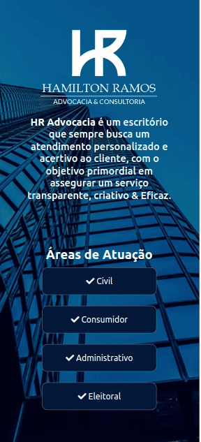

<h1 align="center">Site Institucional</h1>

Site institucional e responsivo feito para o advogado Hamilton Ramos com animações de entrada. O site tem o objetivo de ser direto, passando as informações desejadas em apenas uma página. O briefing de layout foi passado pelo próprio Hamilton.

  <h3> Publicado 🚀 </h3>
  <strong><a href="https://hamiltonramos.adv.br">🔗 Clique Aqui para visualizar</a></strong>

# Sumário
-[Funcionalidades](#funcionalidades)  
-[Imagens](#imagens) 
-[Tecnologias](#tecnologias) 
-[Autor](#autor)  
-[Sobre a Login](https://loja.login.com.br)

# Funcionalidades
- [x] Logo e texto sobre a empresa
- [x] Áreas de atuação
- [x] Texto e Avatar do Profissional
- [x] Contatos de redes sociais
- [X] Animações de entrada

# Imagens

 

# Tecnologias
As ferramentas utilizadas foram:
<ul style="list-style: none">
  <li>Javascript</li>
  <li>Next.Js</li>
  <li>Styled Components</li>
  <li>Framer Motion</li>
</ul>

  <h3> Publicado 🚀 </h3>
  <strong><a href="https://hamiltonramos.adv.br">🔗 Clique Aqui para visualizar</a></strong>

# Autor

Alex Santos

